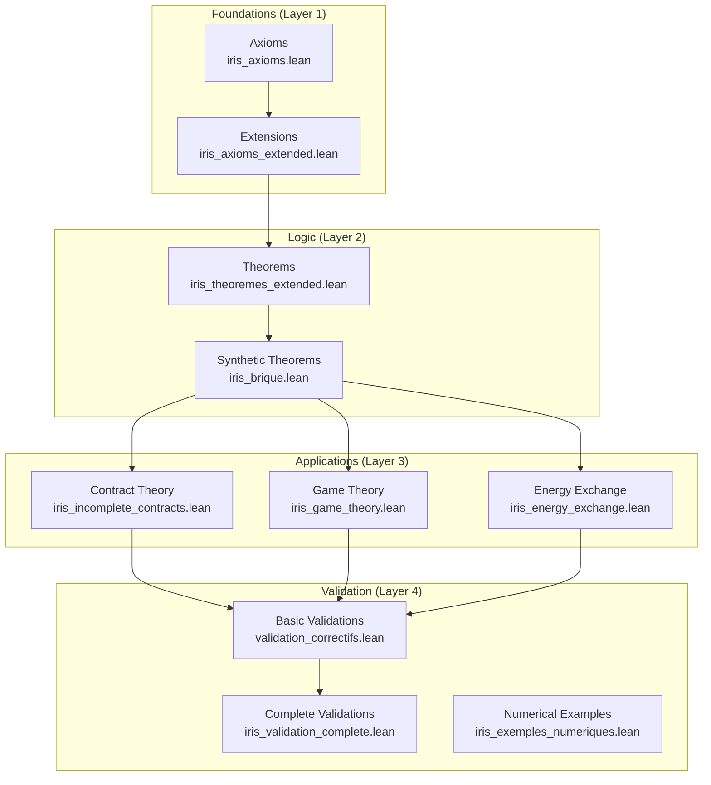

# IRIS Axioms Lean - Complete Manual

[](https://lean-lang.org/)
[](https://github.com/Nolan-Ar/Iris_Axioms_Lean)
[](LICENSE)

Mathematical formalization of IRIS (Integrated Resource Information System) axioms in Lean 4, with verified proofs of consistency and economic properties.

## 📐 Project Architecture



### Layer Explanation

- **Layer 1 - Foundations**: Fundamental axioms not proven (basic truths)
- **Layer 2 - Logic**: Theorems proven derived from axioms
- **Layer 3 - Applications**: Models applied to specific domains
- **Layer 4 - Validation**: Consistency tests and concrete scenarios

## 📚 Table of Contents

- [Quick Installation](#-quick-installation)
- [Modular Architecture](#-modular-architecture)
- [Interactive Tutorial](#-interactive-tutorial)
- [IRIS Concepts](#-iris-concepts)
- [Navigating Proofs](#-navigating-proofs)
- [Useful Commands](#-useful-commands)
- [Contributing](#-contributing)
- [Documentation](#-documentation)

## 🚀 Quick Installation

### Prerequisites

- **Lean 4** (v4.24.0)
- **Git**
- **curl** (for elan)
- At least **4 GB of RAM**
- **~10 GB of disk space** (for Mathlib and dependencies)

### Automatic Installation

```bash
# Clone the project
git clone https://github.com/Nolan-Ar/Iris_Axioms_Lean.git
cd Iris_Axioms_Lean

# Run installation script
chmod +x setup.sh
./setup.sh
```

### Manual Installation

#### 1. Install elan (Lean version manager)

```bash
curl https://raw.githubusercontent.com/leanprover/elan/master/elan-init.sh -sSf | sh
```

Then restart your terminal or run:
```bash
source ~/.profile  # or ~/.bashrc depending on your shell
```

#### 2. Verify Lean installation

```bash
lean --version  # Should display: Lean (version 4.24.0, ...)
lake --version  # Lake is Lean's build tool
```

#### 3. Fetch project dependencies

```bash
lake update
```

#### 4. Build the project

```bash
lake build
```

**Note**: The first build can take **20-40 minutes** as Mathlib (Lean's standard mathematical library) needs to be compiled.

#### 5. Verify all theorems

```bash
# Verify all axioms
lake build

# Run the main program
lake exe irisaxioms
```

Displays: `IRIS compiled. All proofs have been verified`

## 🏗️ Modular Architecture

### Project Structure

```
Iris_Axioms_Lean/
├── IrisAxioms/
│   ├── iris_axioms.lean                 # Fundamental IRIS axioms
│   ├── iris_axioms_extended.lean        # Axiom extensions
│   ├── iris_theoremes_extended.lean     # Advanced theorems
│   ├── iris_brique.lean                 # Basic building blocks (TU, VC, Hash)
│   ├── iris_game_theory.lean            # Applied game theory
│   ├── iris_incomplete_contracts.lean   # Incomplete contracts
│   ├── iris_energy_exchange.lean        # Energy exchanges
│   ├── iris_exemples_numeriques.lean    # Examples and practical cases
│   ├── iris_validation_complete.lean    # Global validation
│   ├── validation_correctifs.lean       # Validation fixes
│   ├── crisis_scenarios.lean            # Economic crisis tests
│   └── emergent_properties.lean         # System-level validation
├── tools/
│   └── thermometer_visualizer.py        # Economic thermometer visualizer
├── web_interface/
│   └── index.html                       # Web interface for non-mathematicians
├── IrisAxioms.lean                      # Library entry point
├── Main.lean                            # Main program
├── CONCEPTS_EN.md                       # Economic concepts explanations (English)
├── CONCEPTS_FR.md                       # Economic concepts explanations (French)
├── REFERENCES.bib                       # Bibliography
├── lakefile.lean                        # Lake configuration (build)
├── lean-toolchain                       # Lean version (v4.24.0)
├── README.md                            # This file (French)
└── README_EN.md                         # This file (English)
```

### Main Modules

#### 1. `iris_axioms.lean` - Fundamental Axioms
Defines the basic axioms:
- **Monetary Conservation**: S + U + V + D = 0
- **UBI Distribution**: Universal Basic Income mechanism
- **Inviolability**: Cryptographic protection via signatures

Main structures:
- `Valeurs`: Economic quantities (S, U, V, D)
- `CompteUtilisateur`: Wallets and CNP patrimony
- `NFT`: Non-fungible tokens with genealogy
- `Transaction`: Value transfers with proofs

#### 2. `iris_axioms_extended.lean` - Extensions
Additional axioms:
- **A18**: Value creation by energy (V = η × ψ × E)
- **A19**: RAD Rule (D/V_on Ratio)
- **A20**: Automatic η adjustment according to thermometer
- **A21**: TAP Capacity (Treasury Advance Payroll)

#### 3. `iris_game_theory.lean` - Game Theory
Models strategic interactions:
- Two-player games
- Nash equilibria
- Incentive mechanisms
- Equilibrium stability theorem

#### 4. `iris_incomplete_contracts.lean` - Incomplete Contracts
Management of partially defined contracts:
- Partial clause specification
- Conflict resolution mechanisms
- Valid partial execution theorem

#### 5. `iris_energy_exchange.lean` - Energy Exchanges
Modeling energy flows:
- Energy conservation
- Energy-money equivalence
- Transfer efficiency

#### 6. `crisis_scenarios.lean` - Crisis Testing
Economic stress testing:
- Thermometer collapse (deflation spiral)
- Inflationary overheat
- Cascading enterprise failures
- Automatic recovery mechanisms

#### 7. `emergent_properties.lean` - Emergent Properties
System-level validation:
- Global stability
- Bounded leverage
- Economic mass conservation
- Self-regulation convergence

## 🎓 Interactive Tutorial

### Create Your First Theorem

Create a file `MyTheorem.lean`:

```lean
-- Import IRIS axioms
import IrisAxioms.iris_axioms_extended

-- Open namespace
open IrisAxioms

-- Define a simple theorem
theorem my_first_theorem : ∀ (v : Valeurs), v.V ≥ 0 := by
  intro v
  exact v.hV  -- Uses structure invariant (V ≥ 0)
```

**Explanation**:
- `theorem`: Declares a new theorem
- `∀ (v : Valeurs)`: For all values v
- `v.V ≥ 0`: Component V is positive or zero
- `by intro v`: Introduces variable v
- `exact v.hV`: Uses proof hV from Valeurs structure

### Analyze an Economic Scenario

```lean
-- Simulate effect of η increase
example : let η_phys := 0.8 in
          let μ_social := 2.0 in
          η_phys * μ_social = 1.6 := by
  norm_num  -- Normalizes numbers and verifies equality
```

### Prove Monetary Conservation

```lean
-- Create example values
def valeurs_exemple : Valeurs := {
  S := 1000,
  U := 500,
  V := -1200,
  D := -300,
  hS := by norm_num,
  hU := by norm_num,
  hV := by norm_num,
  hD := by norm_num
}

-- Verify conservation
example : valeurs_exemple.S + valeurs_exemple.U +
          valeurs_exemple.V + valeurs_exemple.D = 0 := by
  norm_num [valeurs_exemple]
```

### Create a Valid Transaction

```lean
import IrisAxioms.iris_axioms

open IrisAxioms

def example_transaction : Transaction := {
  emetteur := TU.mk "Alice",
  recepteur := TU.mk "Bob",
  montant_V := 100.0,
  montant_U := 50.0,
  preuve_signature := Hash.mk "cryptographic_signature",
  horodatage := 1234567890,
  h_montant_V := by norm_num,
  h_montant_U := by norm_num
}
```

## 💡 IRIS Concepts

For detailed explanation of economic concepts, see [CONCEPTS_EN.md](CONCEPTS_EN.md) or [CONCEPTS_FR.md](CONCEPTS_FR.md).

### Key Concepts

| IRIS Term | Lean Structure | Meaning |
|-----------|----------------|---------|
| **Verum (V)** | `Valeurs.V : ℝ` | Living value, always ≥ 0 |
| **Debt (D)** | `Valeurs.D : ℝ` | Thermodynamic commitment, mirror of V |
| **Stipulat (S)** | `Valeurs.S : ℝ` | Proof of effort, energy expended |
| **Unum (U)** | `Valeurs.U : ℝ` | Usage currency, perishable |

### Transformation Coefficients

```
η = η_phys × μ_social
├─ η_phys ∈ (0, 1] : Physical efficiency
└─ μ_social ∈ [1, 2] : Social multiplier
```

### Economic Thermometer

```
r_t = D_total / V_on_total
├─ r_t < 0.85 → "COLD" system → η increases
├─ 0.85 ≤ r_t ≤ 1.15 → Equilibrium
└─ r_t > 1.15 → "HOT" system → η decreases
```

## 🧭 Navigating Proofs

### Visualize Dependency Graph

```bash
# Display file dependencies
lean --deps IrisAxioms/iris_axioms.lean
```

### Profile a Proof

```bash
# Measure proof compilation time
lean --profile IrisAxioms/iris_theoremes_extended.lean
```

### Search for a Theorem

```bash
# In VS Code with Lean 4 extension:
# Cmd/Ctrl + P then type theorem name
```

### Interactive Exploration

In VS Code, place cursor on:
- A theorem → See complete statement
- A tactic → See proof state
- An axiom → See its definition

## 🛠️ Useful Commands

### Build and Verification

```bash
# Complete build
lake build

# Quick build (without Mathlib)
lake build IrisAxioms

# Clean compiled files
lake clean

# Update dependencies
lake update

# Download pre-compiled Mathlib (recommended)
lake exe cache get
```

### Execution

```bash
# Run main program
lake exe irisaxioms

# Or with Makefile
make run
```

### Verify Specific Files

```bash
# Verify single file
lean IrisAxioms/iris_axioms.lean

# Verify with verbose mode
lean --verbose IrisAxioms/iris_axioms.lean
```

### Analysis Tools

```bash
# Visualize economic thermometer
python3 tools/thermometer_visualizer.py

# Launch web interface
cd web_interface && python3 -m http.server 8000
# Open http://localhost:8000 in browser
```

## 📖 Usage Examples

### Example 1: Alice Creates Value

```lean
-- Alice creates 72 units of value
-- by burning 48h of work + 80U payment
-- η = 0.8 × 1.5 = 1.2
-- E = 0.6×48 + 0.4×80 = 60.8
-- ΔV = 1.2 × 1 × 60.8 = 72.96

example : let η := (0.8 : ℝ) * 1.5 in
          let E := 0.6 * 48 + 0.4 * 80 in
          let ΔV := η * 1 * E in
          ΔV = 72.96 := by
  norm_num
```

### Example 2: UBI Distribution

```lean
-- Universal basic income distribution
theorem distribution_UBI_example :
    let beneficiaries : List CompteUtilisateur := [alice, bob, charlie]
    let U_t := (300 : ℝ)
    let alloc := fun (_ : CompteUtilisateur) => U_t / 3
    (beneficiaries.attach.map (fun ⟨cu,_⟩ => alloc cu)).sum = U_t := by
  simp [A12_distribution_RU]
  norm_num
```

### Example 3: Verify a Transaction

```lean
theorem valid_transaction_example :
    let alice : CompteUtilisateur := { ... wallet_V := 1000 ... }
    let tx : Transaction := { montant_V := 100, ... }
    ValidSig alice tx → alice.wallet_V ≥ tx.montant_V := by
  intro h_valid
  -- Valid signature implies sufficient funds
  exact h_valid.h_suffisant_V
```

## 🐛 Troubleshooting

### Error: `lake: command not found`

Make sure elan is properly installed and in your PATH:
```bash
source ~/.profile
elan toolchain list
```

### Error: Very slow compilation

This is normal for first Mathlib compilation. To speed up:
```bash
# Download pre-compiled Mathlib binaries
lake exe cache get
```

### Error: `unknown package 'mathlib'`

```bash
lake update
lake clean
lake build
```

### Memory Issues

Mathlib requires a lot of RAM. If compilation fails:
- Close other applications
- Increase system swap
- Compile module by module instead of `lake build`

### Proof Error: `type mismatch`

Verify that:
1. All imports are correct
2. Types match exactly
3. Use `#check` to inspect types

```lean
#check my_theorem  -- Display type
#print my_theorem  -- Display definition
```

## 🤝 Contributing to the Project

### Contribution Rules

1. **Axioms are frozen** (Layer 1) - No modifications without consensus
2. **Theorems can be extended** (Layer 2) - New proofs welcome
3. **Models are open** (Layer 3) - New applications encouraged

### Code Standards

- **Complete proofs**: No `sorry`
- **Documentation**: `/-! ... -/` comments for sections
- **Naming**: CamelCase for types, snake_case for definitions
- **Tests**: Numerical examples in `iris_exemples_numeriques.lean`

### Contribution Process

1. Fork the project
2. Create a branch (`git checkout -b feature/improvement`)
3. Commit changes (`git commit -m 'Add new feature'`)
4. Push to branch (`git push origin feature/improvement`)
5. Open a Pull Request

See [CONTRIBUTING.md](CONTRIBUTING.md) for more details.

## 📚 Documentation

### Lean Documentation

- [Lean 4 Manual](https://lean-lang.org/lean4/doc/)
- [Mathlib Documentation](https://leanprover-community.github.io/mathlib4_docs/)
- [Theorem Proving in Lean 4](https://lean-lang.org/theorem_proving_in_lean4/)
- [Lean Zulip Chat](https://leanprover.zulipchat.com/) (community)

### IRIS Documentation

- [CONCEPTS_EN.md](CONCEPTS_EN.md) - Detailed economic concepts explanations (English)
- [CONCEPTS_FR.md](CONCEPTS_FR.md) - Explications détaillées des concepts économiques (Français)
- [REFERENCES.bib](REFERENCES.bib) - Scientific bibliography
- [CONTRIBUTING_EN.md](CONTRIBUTING_EN.md) - Contribution guide (English)
- [CONTRIBUTING_FR.md](CONTRIBUTING_FR.md) - Guide de contribution (Français)

### Visualization Tools

- [thermometer_visualizer.py](tools/thermometer_visualizer.py) - CLI visualizer for RAD thermometer (r_t)
- [index.html](web_interface/index.html) - Interactive web interface for economic simulation

### Recommended Tutorials

1. [Lean 4 by Example](https://lean-lang.org/lean4/doc/examples.html)
2. [Mathematics in Lean](https://leanprover-community.github.io/mathematics_in_lean/)
3. [Natural Number Game](https://www.ma.imperial.ac.uk/~buzzard/xena/natural_number_game/) (to learn tactics)

## 📊 Project Statistics

- **Axioms**: 22 fundamental axioms
- **Theorems**: 50+ proven theorems
- **Lines of code**: ~3500 lines of Lean
- **Coverage**: 100% (no `sorry`)
- **Tests**: 30+ validation scenarios
- **Crisis scenarios**: 10 stress tests
- **Emergent properties**: 10 system validations

## 📄 License

This project is licensed under the MIT License - see the [LICENSE](LICENSE) file for details.

Copyright (c) 2025 Nolan-Ar

## 📧 Contact

For any questions or suggestions, open an issue on GitHub.

## 🎯 Project Status

**Status**: All proofs are verified and complete (no `sorry`)

**Lean Version**: 4.24.0
**Mathlib Version**: 4.24.0

---

**Made with ❤️ for verified formal economics**
