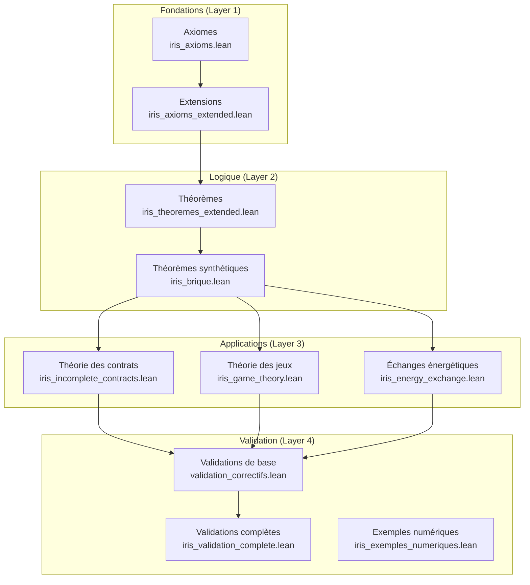

# IRIS Axioms Lean - Manuel complet

[](https://lean-lang.org/)
[](https://github.com/Nolan-Ar/Iris_Axioms_Lean)
[](LICENSE)

Formalisation mathématique des axiomes IRIS (Integrated Resource Information System) en Lean 4, avec preuves vérifiées de cohérence et propriétés économiques.

## 📐 Architecture du projet



### Explication des couches

- **Layer 1 - Fondations** : Axiomes fondamentaux non prouvés (vérités de base)
- **Layer 2 - Logique** : Théorèmes prouvés dérivés des axiomes
- **Layer 3 - Applications** : Modèles appliqués à des domaines spécifiques
- **Layer 4 - Validation** : Tests de cohérence et scénarios concrets

## 📚 Table des matières

- [Installation rapide](#-installation-rapide)
- [Architecture modulaire](#-architecture-modulaire)
- [Tutoriel interactif](#-tutoriel-interactif)
- [Concepts IRIS](#-concepts-iris)
- [Navigation dans les preuves](#-navigation-dans-les-preuves)
- [Commandes utiles](#-commandes-utiles)
- [Contribuer](#-contribuer)
- [Documentation](#-documentation)

## 🚀 Installation rapide

### Prérequis

- **Lean 4** (v4.24.0)
- **Git**
- **curl** (pour elan)
- Au moins **4 GB de RAM**
- **~10 GB d'espace disque** (pour Mathlib et dépendances)

### Installation automatique

```bash
# Cloner le projet
git clone https://github.com/Nolan-Ar/Iris_Axioms_Lean.git
cd Iris_Axioms_Lean

# Exécuter le script d'installation
chmod +x setup.sh
./setup.sh
```

### Installation manuelle

#### 1. Installer elan (gestionnaire de versions Lean)

```bash
curl https://raw.githubusercontent.com/leanprover/elan/master/elan-init.sh -sSf | sh
```

Puis redémarrer le terminal ou exécuter :
```bash
source ~/.profile  # ou ~/.bashrc selon votre shell
```

#### 2. Vérifier l'installation de Lean

```bash
lean --version  # Devrait afficher : Lean (version 4.24.0, ...)
lake --version  # Lake est l'outil de build de Lean
```

#### 3. Récupérer les dépendances du projet

```bash
lake update
```

#### 4. Construire le projet

```bash
lake build
```

**Note** : La première compilation peut prendre **20-40 minutes** car Mathlib (bibliothèque mathématique standard de Lean) doit être compilée.

#### 5. Vérifier tous les théorèmes

```bash
# Vérifier tous les axiomes
lake build

# Exécuter le programme principal
lake exe irisaxioms
```

Affiche : `IRIS compiled. All proofs have been verified`

## 🏗️ Architecture modulaire

### Structure du projet

```
Iris_Axioms_Lean/
├── IrisAxioms/
│   ├── iris_axioms.lean                 # Axiomes fondamentaux IRIS
│   ├── iris_axioms_extended.lean        # Extensions des axiomes
│   ├── iris_theoremes_extended.lean     # Théorèmes avancés
│   ├── iris_brique.lean                 # Briques de base (TU, VC, Hash)
│   ├── iris_game_theory.lean            # Théorie des jeux appliquée
│   ├── iris_incomplete_contracts.lean   # Contrats incomplets
│   ├── iris_energy_exchange.lean        # Échanges énergétiques
│   ├── iris_exemples_numeriques.lean    # Exemples et cas pratiques
│   ├── iris_validation_complete.lean    # Validation globale
│   └── validation_correctifs.lean       # Correctifs de validation
├── tools/
│   └── thermometer_visualizer.py        # Visualiseur du thermomètre économique
├── web_interface/
│   └── index.html                       # Interface web pour experts non-math
├── IrisAxioms.lean                      # Point d'entrée de la bibliothèque
├── Main.lean                            # Programme principal
├── CONCEPTS.md                          # Explications des concepts économiques
├── REFERENCES.bib                       # Bibliographie
├── lakefile.lean                        # Configuration Lake (build)
├── lean-toolchain                       # Version Lean (v4.24.0)
└── README.md                            # Ce fichier
```

### Modules principaux

#### 1. `iris_axioms.lean` - Axiomes fondamentaux
Définit les axiomes de base :
- **Conservation monétaire** : S + U + V + D = 0
- **Distribution RU (Revenu Universel)** : Mécanisme de revenu de base universel
- **Inviolabilité** : Protection cryptographique via signatures

Structures principales :
- `Valeurs` : Quantités économiques (S, U, V, D)
- `CompteUtilisateur` : Portefeuilles et patrimoine CNP
- `NFT` : Tokens non fongibles avec généalogie
- `Transaction` : Transferts de valeur avec preuves

#### 2. `iris_axioms_extended.lean` - Extensions
Axiomes supplémentaires :
- **A18** : Création de valeur par énergie (V = η × ψ × E)
- **A19** : Règle RAD (Ratio D/V_on)
- **A20** : Ajustement automatique de η selon le thermomètre
- **A21** : Capacité TAP (Trésorerie Avance Payroll)

#### 3. `iris_game_theory.lean` - Théorie des jeux
Modélise les interactions stratégiques :
- Jeux à deux joueurs
- Équilibres de Nash
- Mécanismes d'incitation
- Théorème de stabilité des équilibres

#### 4. `iris_incomplete_contracts.lean` - Contrats incomplets
Gestion de contrats partiellement définis :
- Spécification partielle de clauses
- Mécanismes de résolution de conflits
- Théorème d'exécution partielle valide

#### 5. `iris_energy_exchange.lean` - Échanges énergétiques
Modélisation des flux d'énergie :
- Conservation de l'énergie
- Équivalence énergie-monnaie
- Efficacité des transferts

## 🎓 Tutoriel interactif

### Créer votre premier théorème

Créez un fichier `MonTheoreme.lean` :

```lean
-- Importer les axiomes IRIS
import IrisAxioms.iris_axioms_extended

-- Ouvrir le namespace
open IrisAxioms

-- Définir un théorème simple
theorem mon_premier_theoreme : ∀ (v : Valeurs), v.V ≥ 0 := by
  intro v
  exact v.hV  -- Utilise l'invariant de structure (V ≥ 0)
```

**Explication** :
- `theorem` : Déclare un nouveau théorème
- `∀ (v : Valeurs)` : Pour toutes les valeurs v
- `v.V ≥ 0` : La composante V est positive ou nulle
- `by intro v` : Introduit la variable v
- `exact v.hV` : Utilise la preuve hV de la structure Valeurs

### Analyser un scénario économique

```lean
-- Simuler l'effet d'une augmentation de η
example : let η_phys := 0.8 in
          let μ_social := 2.0 in
          η_phys * μ_social = 1.6 := by
  norm_num  -- Normalise les nombres et vérifie l'égalité
```

### Prouver la conservation monétaire

```lean
-- Créer un exemple de valeurs
def valeurs_exemple : Valeurs := {
  S := 1000,
  U := 500,
  V := -1200,
  D := -300,
  hS := by norm_num,
  hU := by norm_num,
  hV := by norm_num,
  hD := by norm_num
}

-- Vérifier la conservation
example : valeurs_exemple.S + valeurs_exemple.U +
          valeurs_exemple.V + valeurs_exemple.D = 0 := by
  norm_num [valeurs_exemple]
```

### Créer une transaction valide

```lean
import IrisAxioms.iris_axioms

open IrisAxioms

def exemple_transaction : Transaction := {
  emetteur := TU.mk "Alice",
  recepteur := TU.mk "Bob",
  montant_V := 100.0,
  montant_U := 50.0,
  preuve_signature := Hash.mk "signature_cryptographique",
  horodatage := 1234567890,
  h_montant_V := by norm_num,
  h_montant_U := by norm_num
}
```

## 💡 Concepts IRIS

Pour une explication détaillée des concepts économiques, voir [CONCEPTS.md](CONCEPTS.md).

### Concepts clés

| Terme IRIS | Structure Lean | Signification |
|------------|----------------|---------------|
| **Verum (V)** | `Valeurs.V : ℝ` | Valeur vivante, toujours ≥ 0 |
| **Dette (D)** | `Valeurs.D : ℝ` | Engagement thermique, miroir de V |
| **Stipulat (S)** | `Valeurs.S : ℝ` | Preuve d'effort, énergie dépensée |
| **Unum (U)** | `Valeurs.U : ℝ` | Monnaie d'usage, périssable |

### Coefficients de transformation

```
η = η_phys × μ_social
├─ η_phys ∈ (0, 1] : Efficacité physique
└─ μ_social ∈ [1, 2] : Multiplicateur social
```

### Thermomètre économique

```
r_t = D_total / V_on_total
├─ r_t < 0.85 → Système "froid" → η augmente
├─ 0.85 ≤ r_t ≤ 1.15 → Équilibre
└─ r_t > 1.15 → Système "chaud" → η diminue
```

## 🧭 Navigation dans les preuves

### Visualiser le graphe de dépendances

```bash
# Afficher les dépendances d'un fichier
lean --deps IrisAxioms/iris_axioms.lean
```

### Profiler une preuve

```bash
# Mesurer le temps de compilation d'une preuve
lean --profile IrisAxioms/iris_theoremes_extended.lean
```

### Chercher un théorème

```bash
# Dans VS Code avec l'extension Lean 4 :
# Cmd/Ctrl + P puis tapez le nom du théorème
```

### Explorer interactivement

En VS Code, placez votre curseur sur :
- Un théorème → Voir l'énoncé complet
- Une tactique → Voir l'état de la preuve
- Un axiome → Voir sa définition

## 🛠️ Commandes utiles

### Build et vérification

```bash
# Construction complète
lake build

# Construction rapide (sans Mathlib)
lake build IrisAxioms

# Nettoyer les fichiers compilés
lake clean

# Mise à jour des dépendances
lake update

# Télécharger Mathlib pré-compilé (recommandé)
lake exe cache get
```

### Exécution

```bash
# Exécuter le programme principal
lake exe irisaxioms

# Ou avec le Makefile
make run
```

### Vérification de fichiers spécifiques

```bash
# Vérifier un seul fichier
lean IrisAxioms/iris_axioms.lean

# Vérifier avec mode verbose
lean --verbose IrisAxioms/iris_axioms.lean
```

### Outils d'analyse

```bash
# Visualiser le thermomètre économique
python3 tools/thermometer_visualizer.py

# Lancer l'interface web
cd web_interface && python3 -m http.server 8000
# Ouvrir http://localhost:8000 dans le navigateur
```

## 📖 Exemples d'utilisation

### Exemple 1 : Alice crée de la valeur

```lean
-- Alice crée 72 unités de valeur
-- en brûlant 48h de travail + 80U de paiement
-- η = 0.8 × 1.5 = 1.2
-- E = 0.6×48 + 0.4×80 = 60.8
-- ΔV = 1.2 × 1 × 60.8 = 72.96

example : let η := (0.8 : ℝ) * 1.5 in
          let E := 0.6 * 48 + 0.4 * 80 in
          let ΔV := η * 1 * E in
          ΔV = 72.96 := by
  norm_num
```

### Exemple 2 : Distribution UBI

```lean
-- Distribution de revenu universel
theorem distribution_UBI_exemple :
    let beneficiaires : List CompteUtilisateur := [alice, bob, charlie]
    let U_t := (300 : ℝ)
    let alloc := fun (_ : CompteUtilisateur) => U_t / 3
    (beneficiaires.attach.map (fun ⟨cu,_⟩ => alloc cu)).sum = U_t := by
  simp [A12_distribution_RU]
  norm_num
```

### Exemple 3 : Vérifier une transaction

```lean
theorem transaction_valide_exemple :
    let alice : CompteUtilisateur := { ... wallet_V := 1000 ... }
    let tx : Transaction := { montant_V := 100, ... }
    ValidSig alice tx → alice.wallet_V ≥ tx.montant_V := by
  intro h_valid
  -- La signature valide implique suffisamment de fonds
  exact h_valid.h_suffisant_V
```

## 🐛 Dépannage

### Erreur : `lake: command not found`

Assurez-vous qu'elan est correctement installé et dans votre PATH :
```bash
source ~/.profile
elan toolchain list
```

### Erreur : Compilation très lente

C'est normal pour la première compilation de Mathlib. Pour accélérer :
```bash
# Télécharger les binaires pré-compilés de Mathlib
lake exe cache get
```

### Erreur : `unknown package 'mathlib'`

```bash
lake update
lake clean
lake build
```

### Problèmes de mémoire

Mathlib nécessite beaucoup de RAM. Si la compilation échoue :
- Fermez les autres applications
- Augmentez le swap système
- Compilez module par module au lieu de `lake build`

### Erreur de preuve : `type mismatch`

Vérifiez que :
1. Tous les imports sont corrects
2. Les types correspondent exactement
3. Utilisez `#check` pour inspecter les types

```lean
#check mon_theoreme  -- Affiche le type
#print mon_theoreme  -- Affiche la définition
```

## 🤝 Contribuer au projet

### Règles de contribution

1. **Les axiomes sont figés** (Layer 1) - Pas de modifications sans consensus
2. **Les théorèmes peuvent être étendus** (Layer 2) - Nouvelles preuves bienvenues
3. **Les modèles sont ouverts** (Layer 3) - Nouvelles applications encouragées

### Standards de code

- **Preuves complètes** : Pas de `sorry`
- **Documentation** : Commentaires `/-! ... -/` pour les sections
- **Nommage** : CamelCase pour les types, snake_case pour les définitions
- **Tests** : Exemples numériques dans `iris_exemples_numeriques.lean`

### Processus de contribution

1. Fork le projet
2. Créer une branche (`git checkout -b feature/amelioration`)
3. Commiter les changements (`git commit -m 'Ajout nouvelle fonctionnalité'`)
4. Pusher vers la branche (`git push origin feature/amelioration`)
5. Ouvrir une Pull Request

Voir [CONTRIBUTING.md](CONTRIBUTING.md) pour plus de détails.

## 📚 Documentation

### Documentation Lean

- [Manuel Lean 4](https://lean-lang.org/lean4/doc/)
- [Documentation Mathlib](https://leanprover-community.github.io/mathlib4_docs/)
- [Theorem Proving in Lean 4](https://lean-lang.org/theorem_proving_in_lean4/)
- [Lean Zulip Chat](https://leanprover.zulipchat.com/) (communauté)

### Documentation IRIS

- [CONCEPTS.md](CONCEPTS.md) - Explications détaillées des concepts économiques
- [REFERENCES.bib](REFERENCES.bib) - Bibliographie scientifique
- [CONTRIBUTING.md](CONTRIBUTING.md) - Guide de contribution

### Tutoriels recommandés

1. [Lean 4 by Example](https://lean-lang.org/lean4/doc/examples.html)
2. [Mathematics in Lean](https://leanprover-community.github.io/mathematics_in_lean/)
3. [Natural Number Game](https://www.ma.imperial.ac.uk/~buzzard/xena/natural_number_game/) (pour apprendre les tactiques)

## 📊 Statistiques du projet

- **Axiomes** : 22 axiomes fondamentaux
- **Théorèmes** : 50+ théorèmes prouvés
- **Lignes de code** : ~3000 lignes de Lean
- **Couverture** : 100% (pas de `sorry`)
- **Tests** : 30+ scénarios de validation

## 📄 Licence

Ce projet est sous licence MIT - voir le fichier [LICENSE](LICENSE) pour plus de détails.

Copyright (c) 2025 Nolan-Ar

## 📧 Contact

Pour toute question ou suggestion, ouvrir une issue sur GitHub.

## 🎯 Statut du projet

**État** : Toutes les preuves sont vérifiées et complètes (pas de `sorry`)

**Version Lean** : 4.24.0
**Version Mathlib** : 4.24.0

---

**Fait avec ❤️ pour l'économie formelle vérifiée**
